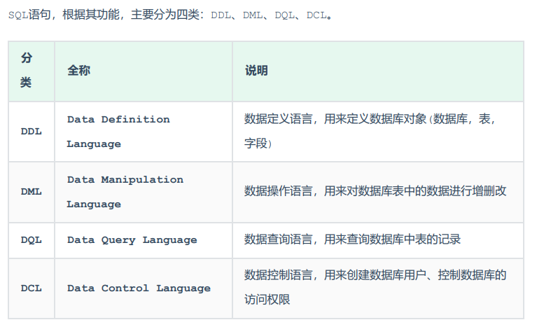

# MySQL的数据类型


## 数值类型


## 字符串类型


## 日期类型


# MySQL语句


## SQL语句的分类




### DDL

Data Definition Language，数据定义语言，用来定义数据库对象(数据库，表，字段) 。


#### 操作数据库


1）查询所有数据库

```sql
show databases 
```


2）查询当前的数据库

```sql
select database() 
```


3）创建数据库

```sql
create database [ if not exists ] 数据库名 [ default charset 字符集 ] [ collate 排序 规则 ] ;
```


4）删除数据库

```sql
drop database [ if exists ] 数据库名 ;
```


5）切换数据库

```sql
use 数据库名 
```


#### 操作表


**查询和创建**

1）查询所有表

```sql
show tables;
```


2）查看表的结构

```sql
desc 表名
```


3）查看指定表的创建语句

```sql
show create table 表名 ;
```


4）创建表

```sql
CREATE TABLE 表名(
字段1 字段1类型 [ COMMENT 字段1注释 ],
字段2 字段2类型 [COMMENT 字段2注释 ],
字段3 字段3类型 [COMMENT 字段3注释 ],
......
字段n 字段n类型 [COMMENT 字段n注释 ]
) [ COMMENT 表注释 ] ;
```


**修改表**


1）添加字段

```sql
ALTER TABLE 表名 ADD 字段名 类型 (长度) [ COMMENT 注释 ] [ 约束 ];
```


2）修改字段的数据类型

```sql
ALTER TABLE 表名 MODIFY 字段名 新数据类型 (长度);
```


3）修改字段及数据类型

```mysql
ALTER TABLE 表名 CHANGE 旧字段名 新字段名 类型 (长度) [ COMMENT 注释 ] [ 约束 ];
```


4）删除字段

```sql
 ALTER TABLE 表名 DROP 字段名;
```


5）修改表名

```sql
ALTER TABLE 表名 RENAME TO 新表名;
```


**删除**

1）删除表

```mysql
DROP TABLE [ IF EXISTS ] 表名;
```


2)清空表中数据

```mysql
TRUNCATE TABLE 表名;
```


### DML

DML英文全称是Data Manipulation Language(数据操作语言)，用来对数据库中表的数据记录进行增、删、改操作。


- 添加数据（INSERT） 
- 修改数据（UPDATE） 
- 删除数据（DELETE）


#### 添加数据


1）给指定字段添加数据

```mysql
INSERT INTO 表名 (字段名1, 字段名2, ...) VALUES (值1, 值2, ...);
```


2）给全部字段添加数据

```mysql
INSERT INTO 表名 VALUES (值1, 值2, ...);
```


3）批量添加数据

```sql
INSERT INTO 表名 (字段名1, 字段名2, ...) VALUES (值1, 值2, ...), (值1, 值2, ...), (值
1, 值2, ...) ;

 INSERT INTO 表名 VALUES (值1, 值2, ...), (值1, 值2, ...), (值1, 值2, ...) ;
```


注意事项：

- 插入数据时，指定的字段顺序需要与值的顺序是一一对应的。
- 字符串和日期型数据应该包含在引号中。
-  插入的数据大小，应该在字段的规定范围内。


#### 修改数据


```mysql
UPDATE 表名 SET 字段名1 = 值1 , 字段名2 = 值2 , .... [ WHERE 条件 ] ;
```


注意事项：

 	修改语句的条件可以有，也可以没有，如果没有条件，则会修改整张表的所有数据。


#### 删除数据


```mysq
DELETE FROM 表名 [ WHERE 条件 ] ;
```


注意事项：

- DELETE 语句的条件可以有，也可以没有，如果没有条件，则会删除整张表的所有数据
- DELETE 语句不能删除某一个字段的值(可以使用UPDATE，将该字段值置为NULL即 可)。


### DQL


DQL英文全称是Data Query Language(数据查询语言)，数据查询语言，用来查询数据库中表的记录。


查询语法

```mysql
SELECT
字段列表
FROM
表名列表
WHERE
条件列表
GROUP BY
分组字段列表
HAVING
分组后条件列表
ORDER BY
排序字段列表
LIMIT
分页参数
```


#### 基础查询


1）查询多个字段

```sql
SELECT 字段1, 字段2, 字段3 ... FROM 表名 ;
```


2）字段设置别名

```sql
 SELECT 字段1 [ AS 别名1 ] , 字段2 [ AS 别名2 ] ... FROM 表名;
```


3）去除重复记录

```sql
SELECT DISTINCT 字段列表 FROM 表名;
```


#### 条件查询

1）语法

```sql
SELECT 字段列表 FROM 表名 WHERE 条件列表 ;
```


2）条件

- 常用的比较运算符


- 常用的逻辑运算符


#### 聚合函数


什么是聚合函数？

将一列数据作为一个整体，进行纵向计算


常见的聚合函数


语法

```sql
SELECT 聚合函数(字段列表) FROM 表名 ;
```


**注意 : NULL值是不参与所有聚合函数运算的。**


#### 分组查询


1）语法

```sql
SELECT 字段列表 FROM 表名 [ WHERE 条件 ] GROUP BY 分组字段名 [ HAVING 分组
后过滤条件 ];
```


2）where和having的区别

- 执行时机不同：where是分组之前进行过滤，不满足where条件，不参与分组；而having是分组 之后对结果进行过滤。 

- 判断条件不同：where不能对聚合函数进行判断，而having可以。


注意事项：

- 分组之后，查询的字段一般为聚合函数和分组字段，查询其他字段无任何意义。
- 执行顺序: where > 聚合函数 > having
- 支持多字段分组, 具体语法为 : group by columnA,columnB


#### 排序查询


1）语法

```sql
SELECT 字段列表 FROM 表名 ORDER BY 字段1 排序方式1 , 字段2 排序方式2 ;
```


2）排序方式

- ASC : 升序(默认值) 
- DESC: 降序


注意事项：

- 如果是升序, 可以不指定排序方式ASC ;
- 如果是多字段排序，当前一个字段值相同时，才会根据后一个字段进行排序 ;


#### 分页查询


1）语法

```sql
SELECT 字段列表 FROM 表名 LIMIT 起始索引, 查询记录数 ;
```


注意事项：

-  起始索引从0开始，起始索引 = （查询页码 - 1）* 每页显示记录数。
- 分页查询是数据库的方言，不同的数据库有不同的实现，MySQL中是LIMIT。
-  如果查询的是第一页数据，起始索引可以省略，直接简写为 limit 10。


#### 执行顺序和编写顺序


如图：

from ... where ... group by ... having ... select ... order by ... limit ...


### DCL

DCL英文全称是Data Control Language(数据控制语言)，用来管理数据库用户、控制数据库的访 问权限。


#### 管理用户


1）查询用户

```sql
select * from mysql.user;
```


2）创建用户

```sql
CREATE USER '用户名'@'主机名' IDENTIFIED BY '密码';
```


3）修改用户的密码

```sql
ALTER USER '用户名'@'主机名' IDENTIFIED WITH mysql_native_password BY '新密码' ;
```


4）删除用户

```sql
DROP USER '用户名'@'主机名' ;
```


注意事项：

-  在MySQL中需要通过用户名@主机名的方式，来唯一标识一个用户。
- 主机名可以使用 % 通配。
- 这类SQL开发人员操作的比较少，主要是DBA（ Database Administrator 数据库 管理员）使用。


#### 权限控制


常用权限列表:


1） 查询权限

```mysql
SHOW GRANTS FOR '用户名'@'主机名' ;
```


2）授予权限

```mysql
GRANT 权限列表 ON 数据库名.表名 TO '用户名'@'主机名';
```


3）撤销权限

```sql
REVOKE 权限列表 ON 数据库名.表名 FROM '用户名'@'主机名';
```


注意事项：

- 多个权限之间，使用逗号分隔
- 授权时， 数据库名和表名可以使用 * 进行通配，代表所有。


# 函数


MySQL中的函数主要分为以下四类： 字符串函数、数值函数、日期函数、流程函数。


## 字符串函数


常用函数


## 数值函数


## 日期函数


## 流程函数

流程函数也是很常用的一类函数，可以在SQL语句中实现条件筛选，从而提高语句的效率。


# 约束


## 约束介绍


什么是约束？

约束是作用于表中字段上的规则，用于限制存储在表中的数据。

保证数据库中数据的正确、有效性和完整性。


约束的分类：


## 外键约束


### 介绍

什么是外键？

用来让两张表的数据之间建立连接，从而保证数据的一致性和完整性。


### 语法


添加外键：

```mysql
CREATE TABLE 表名(
字段名 数据类型,
...
[CONSTRAINT] [外键名称] FOREIGN KEY (外键字段名) REFERENCES 主表 (主表列名)
);


ALTER TABLE 表名 ADD CONSTRAINT 外键名称 FOREIGN KEY (外键字段名)
REFERENCES 主表 (主表列名) ;

```


删除外键：

```mysql
ALTER TABLE 表名 DROP FOREIGN KEY 外键名称;
```


### 删除/更新行为


添加了外键之后，再删除父表数据时产生的约束行为，我们就称为删除/更新行为


具体有以下几种：


语法：

```mysql
ALTER TABLE 表名 ADD CONSTRAINT 外键名称 FOREIGN KEY (外键字段) REFERENCES
主表名 (主表字段名) ON UPDATE CASCADE ON DELETE CASCADE;
```


# 多表查询


## 多表关系


- 一对多
- 多对多
- 一对一


**一对多**

- 案例: 部门 与 员工的关系 
- 关系: 一个部门对应多个员工，一个员工对应一个部门 
- 实现: 在多的一方建立外键，指向一的一方的主键


**多对多**

- 案例: 学生 与 课程的关系 
- 关系: 一个学生可以选修多门课程，一门课程也可以供多个学生选择 
- 实现: 建立第三张中间表，中间表至少包含两个外键，分别关联两方主键


**一对一**

- 案例: 用户 与 用户详情的关系 
- 关系: 一对一关系，多用于单表拆分，将一张表的基础字段放在一张表中，其他详情字段放在另 一张表中，以提升操作效率 
- 实现: 在任意一方加入外键，关联另外一方的主键，并且设置外键为唯一的(UNIQUE)


## 多表查询实现


要执行多表查询，就只需要使用逗号分隔多张表即可，如： select * from emp , dept

通过加上连接查询的条件消除无效的笛卡尔积


### 查询分类


- 连接查询
  - 内连接：相当于查询A、B交集部分数据 
  - 外连接： 
  - 左外连接：查询左表所有数据，以及两张表交集部分数据 
  - 右外连接：查询右表所有数据，以及两张表交集部分数据 
  - 自连接：当前表与自身的连接查询，自连接必须使用表别名
- 子查询


### 内连接


1）隐式内连接

```sql
SELECT 字段列表 FROM 表1 , 表2 WHERE 条件 ... ;
```


2）显式内连接

```mysql
SELECT 字段列表 FROM 表1 [ INNER ] JOIN 表2 ON 连接条件 ... ;
```


### 外连接


1）左外连接

```sql
SELECT 字段列表 FROM 表1 LEFT [ OUTER ] JOIN 表2 ON 条件 ... ;
```

左外连接相当于查询表1(左表)的所有数据，当然也包含表1和表2交集部分的数据。


2）右外连接

```sql
SELECT 字段列表 FROM 表1 RIGHT [ OUTER ] JOIN 表2 ON 条件 ... ;
```

右外连接相当于查询表2(右表)的所有数据，当然也包含表1和表2交集部分的数据。


### 自连接


**自连接查询**


自连接查询，顾名思义，就是自己连接自己，也就是把一张表连接查询多次。

```sql
SELECT 字段列表 FROM 表A 别名A JOIN 表A 别名B ON 条件 ... ;
```


**联合查询**

对于union查询，就是把多次查询的结果合并起来，形成一个新的查询结果集。


```sql
SELECT 字段列表 FROM 表A ...
UNION [ ALL ]
SELECT 字段列表 FROM 表B ....;
```


注意事项：

- 对于联合查询的多张表的列数必须保持一致，字段类型也需要保持一致，否则报错
- union all 会将全部的数据直接合并在一起，union 会对合并之后的数据去重。


### 子查询

1）概念 

SQL语句中嵌套SELECT语句，称为嵌套查询，又称子查询。

```sql
SELECT * FROM t1 WHERE column1 = ( SELECT column1 FROM t2 );
```

子查询外部的语句可以是INSERT / UPDATE / DELETE / SELECT 的任何一个。

 

2）分类 

 根据子查询结果不同，分为： 

-  标量子查询（子查询结果为单个值） 

- 列子查询(子查询结果为一列) 

- 行子查询(子查询结果为一行) 

-  表子查询(子查询结果为多行多列) 


根据子查询位置，分为： 

- WHERE之后 

- FROM之后 

- SELECT之后


**标量子查询**

子查询返回的结果是单个值（数字、字符串、日期等），最简单的形式，这种子查询称为标量子查询。

常用的操作符：= <> > >= < <=


**列子查询**

子查询返回的结果是一列（可以是多行），这种子查询称为列子查询。

常用的操作符：IN 、NOT IN 、 ANY 、SOME 、 ALL


**行子查询**

子查询返回的结果是一行（可以是多列），这种子查询称为行子查询。 

常用的操作符：= 、<> 、IN 、NOT IN


**表子查询**

子查询返回的结果是多行多列，这种子查询称为表子查询。 

常用的操作符：IN


# 事务


## 介绍


什么是事务？

事务是一组操作的集合，它是一个不可分割的工作单位

事务会把所有的操作作为一个整体一起向系统提交或撤销操作请求

即这些操作要么同时成功，要么同时失败


## 控制事务


1）查看/设置事务的提交方式

```sql
SELECT @@autocommit ;

SET @@autocommit = 0 ;-- 修改为手动提交

-- 或开启事务
START TRANSACTION 或 BEGIN ;
```


2）提交事务

```sql
COMMIT;
```


3）回滚事务

```sql
ROLLBACK;
```


## 事务的特性


- 原子性（Atomicity）：事务是不可分割的最小操作单元，要么全部成功，要么全部失败。
- 一致性（Consistency）：事务完成时，必须使所有的数据都保持一致状态。
- 隔离性（Isolation）：数据库系统提供的隔离机制，保证事务在不受外部并发操作影响的独立 环境下运行。
- 持久性（Durability）：事务一旦提交或回滚，它对数据库中的数据的改变就是永久的。


## 事务的并发问题


1）赃读：一个事务读到另外一个事务还没有提交的数据


2）不可重复读：一个事务先后读取同一条记录，但两次读取的数据不同，称之为不可重复读。


3）幻读：一个事务按照条件查询数据时，没有对应的数据行，但是在插入数据时，又发现这行数据 已经存在，好像出现了 "幻影"。


## 隔离级别


为了解决事务并发问题，数据库引入了事务隔离级别


1）查看事务的隔离级别

```sql
SELECT @@TRANSACTION_ISOLATION;
```


2）设置事务隔离级别

```sql
SET [ SESSION | GLOBAL ] TRANSACTION ISOLATION LEVEL { READ UNCOMMITTED |
READ COMMITTED | REPEATABLE READ | SERIALIZABLE }
```


注意事项：事务隔离级别越高，数据越安全，但是性能越低。
